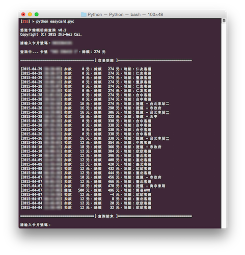

#悠遊卡餘額明細查詢

[](http://vox.vg/)     [][License]

> 由於悠遊卡公司不打算提供一般民眾方便查詢餘額的管道，目前已將查詢功能關閉（詳見[官方聲明][]）。相關討論請瀏覽 [PTT][]。

###不受硬體限制

智慧卡公司對悠遊卡進行加密來禁止對卡片直接的餘額讀取功能，官方提供的查詢程式又僅支援少部分手機，且未對外開放 API 供大眾使用，十分不便。



**悠遊卡餘額明細查詢** 讓你可以在任何支援 Python 的平台查詢你的悠遊卡餘額以及明細。

###使用說明

您的系統必須安裝 **Python 2.x** 及相關套件方能使用本程式。

您可以使用下列指令安裝缺少的模組：

```bash
pip install pycrypto pytz
```

> Mac OS X 已內建 Python，使用者僅需安裝額外的套件即可。

執行方式為：

```bash
python easycard.py [悠遊卡背面上的卡號]
```

> JavaScript 製作的網頁查詢版本請見：http://vox.vg/blog/2015/05/05/reverse-engineering-private-apis-for-easy-card-balance-checking/demo/

###版權聲明

詳見 [`LICENSE`][License] 檔案。

[License]: https://github.com/x43x61x69/Easy-Card/blob/master/LICENSE
[官方聲明]: http://www.easycard.com.tw/news/event-page.aspx?id=1212
[PTT]: https://www.ptt.cc/bbs/IC-Card/M.1431150851.A.E18.html
